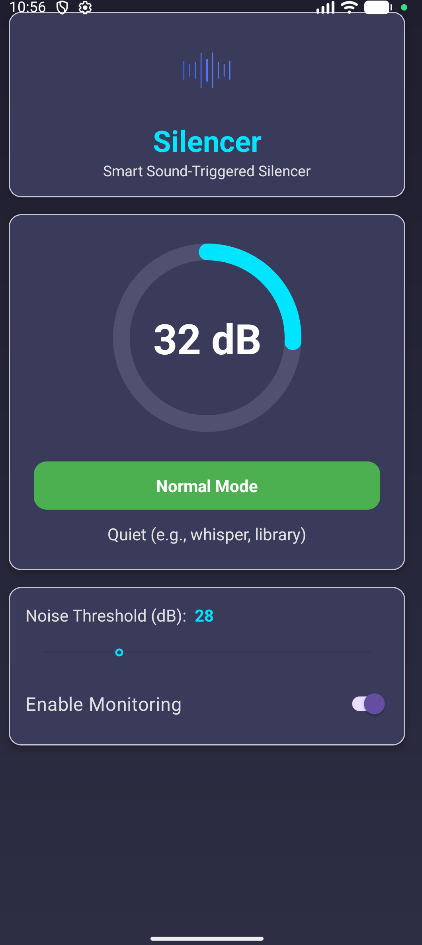
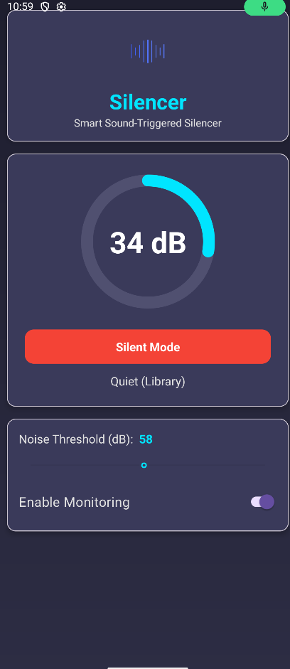

# Silencer - Smart Sound-Triggered Silencer

Silencer is an intelligent Android application that monitors the ambient noise level of your surroundings. It automatically switches your phone to Silent Mode when the environment is quiet and restores it to Normal Mode when the noise level rises.

  

---

## ✨ Core Features

* **Real-time Decibel Monitoring:** Uses the `AudioRecord` API to process the raw microphone stream and calculate a live dB level.
* **Automatic Ringer Control:** Intelligently switches the phone to **Silent Mode** when the ambient noise is *below* the user's threshold for 10 seconds.
* **Smart Restoration:** Automatically returns the phone to **Normal Mode** when the noise level rises *above* the threshold for 10 seconds.
* **User-Defined Threshold:** An easy-to-use `SeekBar` to set the exact "quiet" threshold (0-120 dB).
* **Live Analogy:** A dynamic text field that provides a real-world analogy for the current noise level (e.g., "Quiet / Library", "Loud / Traffic").
* **Persistent Background Service:** All monitoring runs inside a `ForegroundService`, ensuring the app works 24/7, even when minimized or the screen is off.
* **Modern UI:** A sleek, responsive dashboard built with Material 3 components, Lottie animations, and a `CircularProgressIndicator`.

---

## 🛠️ Technology Stack & Key Concepts

* **Language:** [Kotlin](https://kotlinlang.org/)
* **Platform:** Native Android
* **UI:** XML with Material 3 components and View Binding
* **Animation:** [Lottie](https://lottiefiles.com/) for a dynamic microphone icon
* **Core APIs:**
    * `ForegroundService`: For persistent background operation.
    * `AudioRecord`: For raw, low-level microphone access.
    * `AudioManager`: For controlling the system's ringer mode.
    * `LocalBroadcastManager`: For safe and efficient communication between the service and the UI.
* **Permissions Handled:**
    * `RECORD_AUDIO`
    * `ACCESS_NOTIFICATION_POLICY` (Do Not Disturb Access)
    * `POST_NOTIFICATIONS` (For the Foreground Service)
    * `FOREGROUND_SERVICE`
    * `FOREGROUND_SERVICE_MICROPHONE`

---

## 🚀 How to Run

### 1. Build from Source (Recommended)

1.  Clone this repository: `git clone https://github.com/AryanKo/SilencerApp.git`
2.  Open the project in the latest version of [Android Studio](https://developer.android.com/studio).
3.  Let Gradle sync all dependencies.
4.  Run the app on a physical Android device (recommended) or an emulator.

### 2. Install the APK

1.  Navigate to `app/build/outputs/apk/debug/` in this project.
2.  Download the `app-debug.apk` file to your Android phone.
3.  Open the file. You may need to grant your browser permission to **"install unknown apps"**.
4.  Install and run the app.

**Note:** The app will require three permissions to function: **Microphone**, **Do Not Disturb Access**, and **Notifications**.
